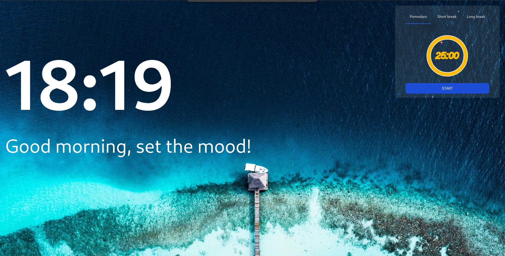

# Percesson (🚧 WIP)

Best personal dashboard for your browser. Create your own variations of widgets, with different positions and themes.

## Example of a variation



## Technologies

- Nx Typescript
- Solid-js Qwik Nestjs Prisma Zod
- Effector Rxjs
- Tailwindcss daisy-ui
- Eslint-kit Changeset Reviewpad Lefhook

## Features

- Weather
- Notes
- Gmail
- Pomodoro

## Setup for development

### Clone repo

- fork

```shell
git clone git@github.com:raidenmiro/percesson.git
```

### Configure environment

- Change `env.example` to `.env`

```dotenv
# Optional
PORT=3333

# Database
DATABASE_URL=
DATABASE_USERNAME=
DATABASE_PASSWORD=

# Unsplash
UNSPLASH_TOKEN_ACCESS=
UNSPLASH_SECRET=
UNSPLASH_URL="https://api.unsplash.com/"

# Weather
WEATHER_KEY=
WEATHER_URL="https://api.openweathermap.org/data/3.0/"
```

- Install dependency

```sh
pnpm install
```

- Run

```sh
pnpm start
```
